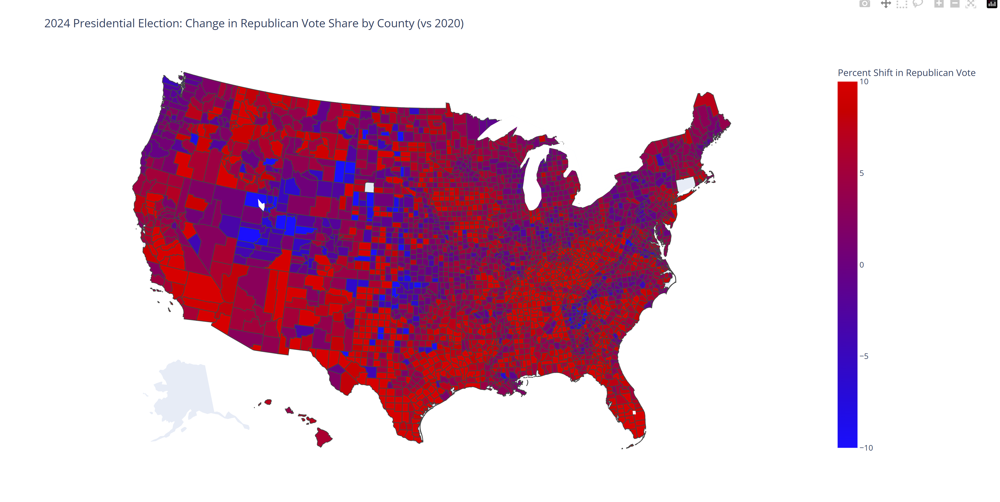

# Plotly Visualization for Election Data

## Data Source

- 2024 (<https://github.com/nytimes/presidential-precinct-map-2024?tab=readme-ov-file>)
- 2020 (<https://github.com/tonmcg/US_County_Level_Election_Results_08-24>)
